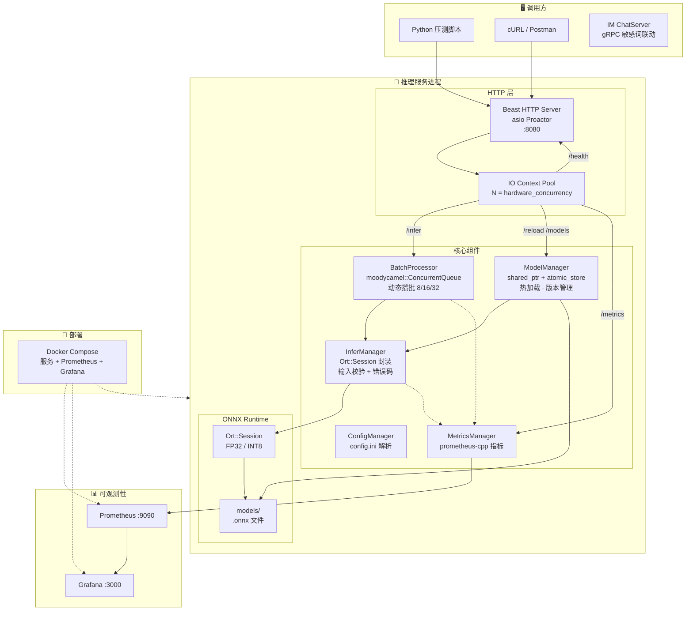

# ONNX Runtime 高性能推理服务

> C++17 从零构建 | 动态批处理 | 热加载 | INT8 量化 | 可观测性

---

## 职责

高性能 ONNX 模型推理服务。负责：

- 加载和管理多个 ONNX 模型，对外提供 HTTP 推理接口
- 动态攒批：将并发请求合并为批量推理，提升 GPU/CPU 吞吐
- 热加载：推理过程中替换模型文件，不掉请求、不阻塞服务
- 多版本管理：同模型 v1/v2 并行加载，支持版本路由与原子回滚
- 可观测性：Prometheus 指标采集 + Grafana 仪表盘
- gRPC 联动：与 IM ChatServer 对接，提供敏感词审核能力（Day 26）

---

## 文件

| 文件 | 说明 |
|------|------|
| `main.cpp` | 启动入口：加载配置 → 创建 IO Context Pool（N = hardware_concurrency）→ 注册 SIGINT/SIGTERM 优雅关闭 |
| `ConfigManager.h/.cpp` | INI 配置解析器：读取 `[server]` 端口/线程数、`[model]` 路径/输入上限、`[batch]` 攒批参数、`[log]` 日志级别 |
| `HttpServer.h/.cpp` | Beast HTTP 服务器：路由 `/infer` `/reload` `/models` `/metrics` `/health`，异步 Proactor 模式 |
| `InferManager.h/.cpp` | ONNX Runtime 推理封装：`Ort::Session` 生命周期管理、单次推理 `Run()`、输入校验 + 结构化错误码 |
| `ModelManager.h/.cpp` | 多模型管理 + 热加载：`shared_ptr + atomic_store` 原子替换模型实例，引用计数保护旧实例平滑释放 |
| `BatchProcessor.h/.cpp` | 动态批处理器：`moodycamel::ConcurrentQueue` 无锁队列，32 条或 10ms 触发攒批，100ms 饥饿保护 |
| `MetricsManager.h/.cpp` | Prometheus 指标采集：Counter (`infer_requests_total`)、Histogram (`infer_latency_seconds`)、Gauge (`batch_size_current`, `queue_depth`) |

---

## 架构图



## 路由设计

| 方法 | 路径 | 功能 |
|------|------|------|
| POST | `/infer` | 模型推理 |
| POST | `/reload` | 模型热加载 |
| GET  | `/models` | 版本列表 |
| POST | `/models/register` | 注册新版本 |
| POST | `/models/rollback` | 版本回滚 |
| DELETE | `/models/{name}/{version}` | 卸载版本 |
| GET  | `/metrics` | Prometheus 指标 |
| GET  | `/health` | 健康检查 |

## 技术栈

| 类别 | 技术 | 用途 |
|------|------|------|
| 语言 | C++17 | 核心逻辑 |
| 网络 | asio + Beast | HTTP 服务 + Proactor 并发 |
| 推理 | ONNX Runtime C++ API | 模型加载 + 推理 |
| 日志 | spdlog | 异步日志 |
| 指标 | prometheus-cpp | QPS / 延迟 / 批处理大小 |
| 可视化 | Grafana | 仪表盘 |
| 队列 | moodycamel::ConcurrentQueue | 无锁批处理队列 |
| 量化 | onnxruntime_quantization | INT8 量化 |
| 测试 | Google Test | 单元测试 |
| CI/CD | GitHub Actions | 自动编译 + 测试 |
| 容器 | Docker + Docker Compose | 一键部署 |

## 快速开始

```bash
# 编译
cmake -B build -DCMAKE_BUILD_TYPE=Release
cmake --build build

# 运行
./build/onnx_server config.ini
```

## 项目结构

```
ONNX/
├── CMakeLists.txt
├── config.ini
├── README.md
├── src/
│   ├── main.cpp              # 入口 + IO Context Pool + 信号处理
│   ├── ConfigManager.h/.cpp   # INI 配置解析
│   ├── HttpServer.h/.cpp      # Beast HTTP 服务
│   ├── InferManager.h/.cpp    # ONNX Runtime 推理封装
│   ├── ModelManager.h/.cpp    # 多模型管理 + 热加载
│   ├── BatchProcessor.h/.cpp  # 动态批处理器
│   └── MetricsManager.h/.cpp  # Prometheus 指标
├── models/                    # .onnx 模型文件
└── test/                      # 单元测试 (Google Test)
```